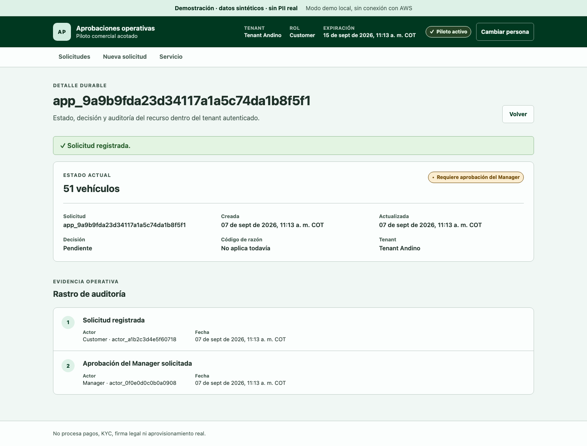

# Aprobaciones operativas


Una solicitud, una decisión responsable y un historial que permite explicar qué ocurrió. Este proyecto demuestra cómo llevar una aprobación empresarial desde el registro hasta su aceptación o rechazo, manteniendo separados los datos de cada organización.

**Estado:** candidato funcional local con datos sintéticos. Este repositorio no tiene un entorno AWS desplegado ni clientes productivos acreditados. La evidencia reproducida está en [evidence/status.md](evidence/status.md).

## Para quién sirve

Equipos de operaciones que coordinan solicitudes por correo, hojas de cálculo o mensajes y necesitan responder: quién solicitó, quién decidió, con qué razón y qué servicio quedó activo. La consultoría propuesta adapta un proceso concreto y sus responsabilidades antes de construir integraciones.

El ejemplo incluido usa solicitudes de flota: hasta 50 vehículos se aprueban automáticamente; más de 50 requieren un Manager del mismo tenant. El umbral está implementado en el ejemplo; todavía no es un motor de políticas configurable para cualquier sector.

## Probar el recorrido

Requisitos: Python 3.11 o superior; Node.js 22.12 o superior y npm. El entorno verificado se registra junto a los resultados. Desde la raíz:

```bash
python3 -m venv .venv
.venv/bin/python -m pip install -r requirements-dev.txt
npm ci --prefix sales_demo/web
make demo
```

Abre la dirección localhost indicada por Vite. Selecciona `Customer sintético A`, registra 50 vehículos y observa la activación. Crea otra solicitud de 51, cambia a `Manager sintético A` y apruébala. Con 52, registra un rechazo con razón. Las cuatro identidades son simuladas y no requieren contraseñas.

La demostración del navegador usa `localStorage`. El backend Python tiene su propio servidor y almacenamiento en memoria, comprobados por separado con `make smoke-api`. **Esta demo visual no consume la API Python y no acredita una integración frontend/backend desplegada.**

Para verificar la copia:

```bash
make check-local PYTHON=.venv/bin/python
```

Playwright necesita su navegador Chromium instalado. Si no existe, `npx --prefix sales_demo/web playwright install chromium` lo descarga de forma explícita. Los checks no crean recursos AWS. `terraform-static` requiere el CLI Terraform; las comprobaciones mock adicionales se explican en el runbook.

## Qué puede evaluarse hoy

- Registro, aprobación automática, aprobación humana y rechazo con razón auditable.
- Dos organizaciones sintéticas, cuatro identidades y denegación de acceso cruzado.
- Idempotencia, cuotas por tenant, expiración del piloto y decisión asíncrona sin reenvío del comando aceptado.
- API OpenAPI, dominio Python, cliente React/TypeScript y pruebas negativas.
- IaC candidato para Cognito, API Gateway, Lambda, DynamoDB, Step Functions, S3/CloudFront y expiración programada. Requiere completar y revisar el bootstrap independiente descrito en la arquitectura.

No procesa pagos, firma legal, KYC, telemetría ni datos personales reales. No hay métricas de ahorro, disponibilidad o desempeño en clientes que podamos atribuir a esta versión.

## Propuesta de piloto de consultoría

Partimos de **un proceso, dos roles y un resultado observable**. Se acuerda una muestra sintética, se define la regla de derivación y se demuestra el recorrido con la persona que decide. La entrega incluye aplicación, arquitectura, contratos, pruebas y un procedimiento de operación. Integraciones reales y despliegue son un siguiente alcance medible, con presupuesto y entorno acordados.



Consulta [el piloto](docs/pilot.md), [arquitectura actual y objetivo](docs/architecture.md), [runbook](docs/runbook.md), [procedencia](docs/provenance.md) y [documentación base conservada](docs/base/README.md).

## Organización

```text
sales_demo/backend/       Dominio, API, worker, repositorios y demo en memoria
sales_demo/web/           Interfaz, modo local, cliente HTTP y pruebas de navegador
sales_demo/terraform/     IaC candidato y controles operativos para futura adaptación
sales_demo/openapi.yaml   Contrato HTTP
sales_demo/tests/         Pruebas de comportamiento, contrato y paquetes
docs/base/               Base técnica sanitizada, separada del estado actual
docs/                    Piloto, decisiones, arquitectura y procedencia
evidence/                Resultados comprobables y límites de evidencia
scripts/                 Smoke HTTP local y verificación del manifiesto de origen
```

Se conserva `sales_demo` como nombre interno del paquete para mantener sus imports y entrypoints. La identidad visible es independiente del caso de origen.

## Conversar sobre un piloto

El [plan de piloto](docs/pilot.md) propone alcance y criterios de aceptación.
Puedes contactar a Sebastián Jaramillo desde su [perfil de GitHub](https://github.com/sjaramillov)
para adaptar la demostración a un proceso concreto. [Autoría y condiciones de uso](NOTICE.md).

## Arquitectura visual

La [galería del proyecto](docs/visuals/README.md) reúne la portada, la arquitectura de solución y la revisión de AWS Well-Architected. Los diagramas identifican los componentes existentes y el diseño propuesto, con fuentes oficiales y evidencia del proyecto. Incluyen PNG para compartir y SVG editables.
