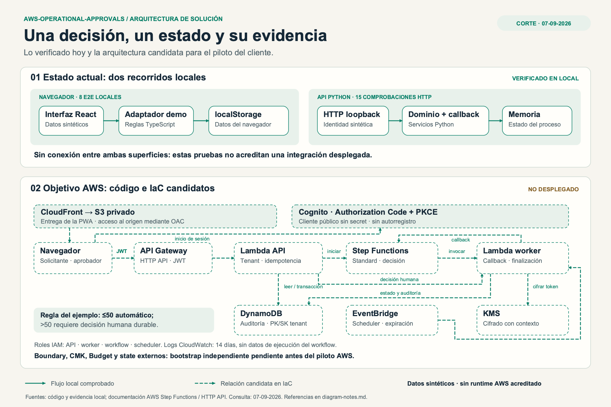
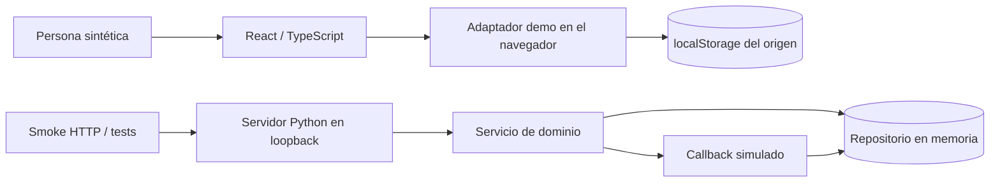
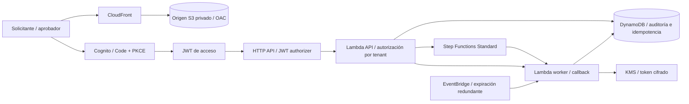

# Arquitectura actual y objetivo

[Diagrama editable](visuals/solution-architecture.svg) · [Revisión Well-Architected](visuals/well-architected.png) · [Notas y fuentes](visuals/diagram-notes.md)

## Actual: dos superficies locales verificables

La UI demo y el servidor Python son comprobados por separado. No existe una flecha UI→Python en la demostración entregada. El modo demo elige identidades sintéticas; no sirve como autenticación real ni debe publicarse como consola productiva. La API local admite `x-demo-sub` únicamente para la demostración; el adaptador AWS espera claims validados por API Gateway.

## Objetivo AWS: IaC candidato, no desplegado desde este repositorio

El cliente HTTP, PKCE, handlers, adaptadores AWS, workflow e infraestructura están implementados como candidato. Su presencia no acredita funcionamiento administrado. Las reglas tienen pruebas locales y mock; no hay evidencia de Cognito, CloudFront o Step Functions reales en esta extracción.

## Dependencia que falta resolver antes de planear AWS

El módulo comercial espera guardrails externos: rol de despliegue, boundary de aplicación, CMK, Budget, state remoto y permisos para el ciclo de vida. Sus validadores retienen el contrato estricto de un piloto FREE con cuota, créditos, MFA, siete policies y recursos efímeros. Se neutralizaron los nombres, pero **no se generalizó ni se provisionó ese bootstrap**. El módulo del entorno original se excluyó para no copiar su contexto operativo.

Por tanto, este repositorio no ofrece hoy un `terraform apply` autónomo. Para un cliente se debe implementar el bootstrap independiente, revisar límites de IAM y el modelo de cuenta, adaptar los validadores y volver a comprobar todo. No se deben relajar sus checks para reutilizar una cuenta cualquiera.

## Decisiones conservadas

| Decisión | Razón | Evidencia / límite |
|---|---|---|
| Dominio y adaptadores separados | Probar reglas sin credenciales ni recursos remotos | Tests de API, servicio y memoria |
| Tenant resuelto por identidad en servidor | No confiar en un `tenantId` enviado por el cliente | Tests de acceso cruzado y roles |
| Idempotencia durable en el diseño AWS | Evitar duplicación por reintentos y concurrencia | Tests con repositorio simulado; falta runtime AWS |
| Standard con callback humano | La decisión puede llegar después de registrar la solicitud | Workflow y tests de lease/finalización |
| `202` y consulta de estado | No afirmar decisión terminada antes del commit durable | Cliente, OpenAPI y pruebas de polling |
| Expiración en cada efecto | El scheduler es una redundancia, no el único control | Reloj inyectado y pruebas de expiración |
| Origen S3 privado y PKCE | Separar contenido público de identidad y autorización | IaC y pruebas estáticas; falta despliegue |

## Observabilidad futura

Correlación, etapa, resultado y razón sin registrar tokens o payloads personales. Medir decisiones fallidas, latencia hasta resultado durable, conflictos de idempotencia y expiración. Un dashboard y una alerta no prueban entrega, disponibilidad o éxito sin eventos observados.
